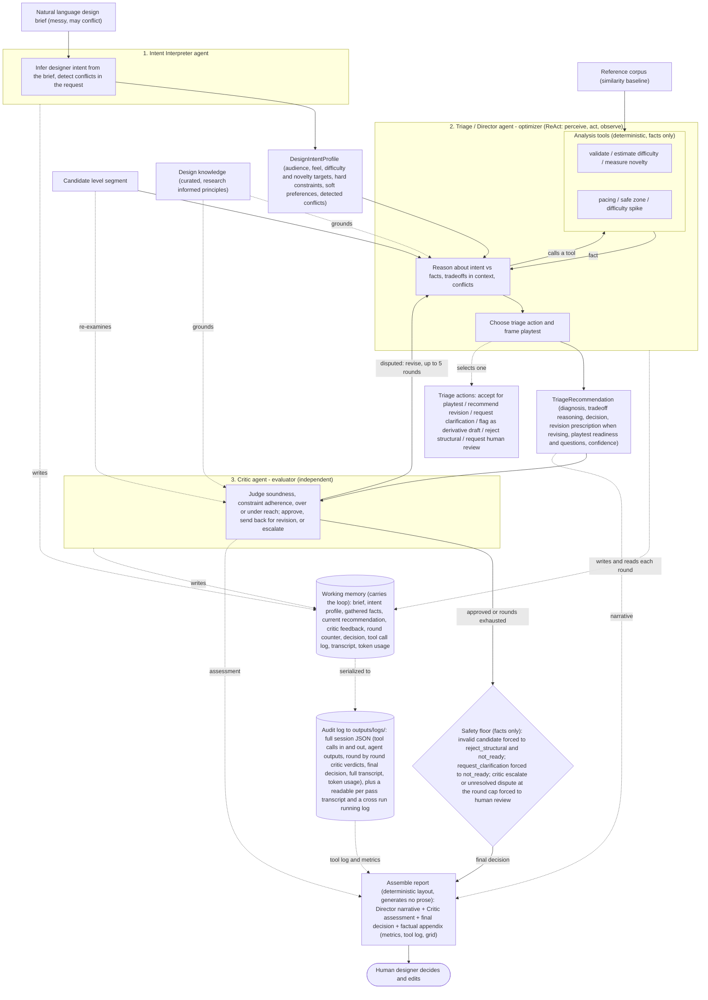

# AI Level Design Triage Agent — Architecture

A clean, advisory design. The system is a design direction layer: given a natural
language design brief and one candidate level segment, it interprets the
designer's intent, uses deterministic tools as evidence, reasons about the
tradeoffs in context, and recommends the next design action. It never edits the
level. The human designer keeps full creative control and makes every change.

## Governing principle

> Deterministic code owns FACTS and SAFETY. The LLM owns JUDGMENT, DECISION, and
> EXPLANATION.

Every component is held to one litmus test: if the agent were removed and only
the tools remained, what would be lost? If the answer is only prose, the
component is fake. Here the answer is intent interpretation, contextual tradeoff
reasoning, conflict detection, triage decision, and human review escalation.

## Structural pattern: bounded evaluator-optimizer

The Triage agent is the optimizer and the Critic is the evaluator. The Critic
evaluates the Triage agent's recommendation; if it finds the recommendation
unsound or in conflict with the intent constraints, it sends it back for revision,
up to a hard cap of 5 rounds. If the Critic approves, the
recommendation finalizes. If the rounds are exhausted with the Critic still
unsatisfied, the recommendation finalizes but escalates to human review. The loop
optimizes the quality of the advice, which is the product, so it lives inside the
agent and Project 7 reuses it unchanged. The cap keeps it bounded, never open
ended debate.

## The three agents and what each genuinely owns

1. **Intent Interpreter** — reads the free text brief, infers a structured
   `DesignIntentProfile` (audience, desired feel, difficulty and novelty targets,
   hard constraints, soft preferences), and detects conflicts in the request
   itself. This is the convert messy human input to structure task that tools
   cannot do.
2. **Triage / Director** — a ReAct agent. It calls the analysis tools for facts,
   then reasons about intent versus facts, the tradeoffs in this specific context
   (for example, is low novelty actually bad when the designer asked for style
   consistency), and the conflicts, grounded in the design knowledge. It chooses
   one triage action and frames the playtest.
3. **Critic / Evaluator** — independently re examines the candidate, the intent,
   and the facts against the Director's recommendation. It judges whether the
   diagnosis is sound, whether hard constraints are respected, and whether the
   decision over or under reaches. It can approve the recommendation, send it back
   to the Triage agent for revision (up to the round cap), or escalate to human
   review. The pass back is the point: without it the Critic would be a veto that
   a deterministic check could replace, not a genuine evaluator.

## Deterministic parts (kept deliberately thin)

- **Analysis tools**: validation, difficulty, novelty and similarity, pacing,
  safe zone, difficulty spike. Facts only. They never decide.
- **Safety floor**: the only hard rule is that a structurally invalid level can
  never be reported as ready, and a Critic veto can only escalate toward the safe
  outcome. The floor never converts one agent decision into another.
- **State and logging**: working memory carries the brief, intent profile, the
  evolving recommendation, the Critic's feedback, and the round counter through the
  pass, so the optimizer can revise across rounds (this is what makes the memory
  load bearing rather than a write only audit object). A separate audit log
  persists every tool call with its inputs and outputs, each agent's output, the
  round by round Critic verdicts, and the final decision to outputs/logs/, for
  transparency and the rubric's log all tool calls safeguard.
- **Report**: contains no machine generated prose. The Director authors the design
  direction narrative (diagnosis, tradeoff reasoning, revision prescription,
  playtest questions) and the Critic authors its assessment; the report step only
  lays out their text, adds the final decision, and appends a factual appendix
  (exact metrics, tool log, the level grid) so the numbers are ground truth rather
  than hallucinated.

## Terminal triage actions

accept for playtest (with targeted playtest questions), recommend revision (emits
a revision prescription, see below), request clarification (the brief is ambiguous
or self conflicting), flag as derivative draft (style consistent but too similar
to be final), reject for structural reasons (needs a different or regenerated
candidate), request human review (conflicting signals that need designer
judgment).

## Revision prescription (the recommend revision output)

When the decision is recommend revision, the agent does not touch the level. It
produces a revision prescription: an ordered list of concrete suggested edits,
each paired with the reason it serves the interpreted intent, written to respect
the hard constraints (for example, preserve the main layout), followed by a
targeted playtest question. The designer decides whether and how to apply it.
This keeps the output actionable and defensible while leaving every edit to the
human. Example:

> Recommendation: Revise before playtest.
> Reason: The level matches the easy target globally, but the first enemy appears
> near an early jump and may create a local frustration spike.
> Suggested edits: (1) move the enemy 4 to 6 tiles later; (2) add a safe landing
> platform before the first enemy; (3) preserve the main ground layout to keep the
> current pacing.
> Playtest question: did the first jump feel fair?

## Project 6 vs Project 7 boundary

Project 6 owns the agent and its internal bounded evaluator-optimizer loop. That
loop refines the advice on a single candidate and is part of the agent, so
Project 7 reuses the agent unchanged.

Project 7 owns the outer product loop: it generates several candidates (Project
5), runs each through the Project 6 agent, ranks them, folds in playtester
feedback (Project 3), and iterates the design across rounds. Project 7 integrates
the agents into a coherent system; it does not redesign the agent.

## Legend

- Solid arrows: the control flow of one bounded advisory pass.
- The Director loop: it calls a deterministic tool, reads the fact, and repeats
  until it decides. The agents decide; the tools only measure.
- Persona: each agent's persona, meaning its role, decision rules, and behavioral
  boundaries, is defined by a prompt template in prompt_templates/tuned/ and
  injected as the agent's instructions.
- Reasoning loop: the Director loop above (the ReAct cycle) wrapped in the
  evaluator-optimizer loop between the Director and the Critic is the system's
  reasoning loop, which produces and then refines the recommendation.
- Dotted grounding arrows: the design knowledge is injected into the reasoning
  agents so they judge with curated principles.
- The evaluator-optimizer loop: the Critic can return the recommendation to the
  Triage agent for revision, up to a hard cap of 5 rounds; an unresolved dispute
  after the cap escalates to human review.
- The diamond is the only deterministic decision point, and it can only enforce
  facts and escalate toward the safe outcome.
- The left cylinder is the working memory that carries the loop (written and read
  each round). The right cylinder is the audit log persisted to outputs/logs/ for
  transparency and the report's factual appendix.
- The report generates no prose. The Director and Critic write all narrative; the
  report step only assembles their text and appends ground truth facts.
- The agent never edits the level. Every change is made by the human designer.
